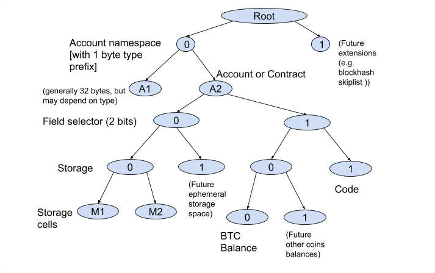

# Combined State Tree

|RSKIP          |16           |
| :------------ |:-------------|
|**Title**      |Combined State Tree |
|**Created**    |01-NOV-2016 |
|**Author**     |SDL |
|**Purpose**    |Sca |
|**Layer**      |Core |
|**Complexity** |3 |
|**Status**     |Draft |

## Pre-git revisions

Date: 06-09-2016

Revision: 3 (date 06-23-2017)

Status: Draft

# **Abstract**

The state of the RSK blockchain is split into several data structures. The account trie, the storage tries tries and the smart contracts code. This brings several problems. To prevent the state to fill all available persistent storage, old unused parts of the state must be removed (e.g. one month old). However to do this, it’s necessary to mark the modification date of every trie, and the platform may hold millions of them. Therefore it’s highly beneficial if all the information is held in a single trie. Therefore a single mark-and-sweep algorithm can remove unused parts. This RSKIP proposes a new structure for the world-state trie, combining accounts, contracts and storage, and enabling future improvements.

# **Motivation**

The current RSK trie (inherited from Ethereum) has several problems, both in its design and in its implementation:
The world-state consist of the state trie, plus the contract storage tries, plus the contract codes. Each of these data structures must be  managed by an appropriate cache system that decides when to keep the data in memory, when to send it to SSD disk or even HDD disk. This multiplicity of caches of different kinds complicates the design of the platform node considerably. 
The same for the removal of unused parts of the state.
There is no space in this state to store a accounts controlled by a different signature algorithm (e.g. RSA) or address hash digest length (e.g. 32 bytes).

# **Specification**

We merge the contract storage memory and account/contract memory into a single tree, as depicted by the following figure:

Changes:

1. Each address will be prefixed by a single byte indicating its type. For type 0 (the only currently), 
the remaining 20 bytes of the address are always randomized by the “secure” trie (sha3() hashed) and converted 
into a 32-byte value. Note that the address type is NOT hashed.
2. The type identifies both the signature algorithm (e.g. RSA, ECDSA, Merkle-Winternitz, etc.) and the length of the key 
in the account secured state tree, according to this rules:
* Bits 0,1:
  * 00: Standard RSK or Ethereum keys. Single-hashed address (according to [RSKIP32]). 32 bytes (full SHA3 hash digest) keys.  Note that single-hashed 20-byte addresses are secured and therefore end up in a 32 byte key.
  * 10: Double-hashed address (according to [RSKIP32]). The original 31-byte address is used to index into the trie.
  * 11:  Double-hashed address (according to [RSKIP32]). The original 20 bytes prefix of the address are used.
* Bit 2,3: reserved, must be 0.
* Bits 4-7: Signature algorithm
  * 0000 = Bitcoin ECDSA curve

3. Behind each account node, there is a Account node tree.  There are several fields in this tree. Each field is identified by a single byte fieldSelector. This byte is not "randomized" by a hash:

 * a. 0x00: Storage cells
 * b. 0x01: Code
 * c. 0x02: Alternate storage cells for future improvements.
 * d. 0x03: Future BTC Balance
 * e. 0x04: Other balances for future improvements 

Storage Cell keys are also randomized by a hash function application.

Must further prevent confusion between accounts, storage and code. This helps SPV nodes detect maliciuous SPV proofs based on type-confusion. Therefore values in node data should be prefixed by node type when stored into the tree:

* A for account
* B for BTC Balance
* C for contractm
* S for storage
* D for coDe

Another possibility is that the Account node is identified, and then the childs are scanned only if the Account is correct.

## Path components 

Each key is split into the four parts:

* Account Type & Namespace [1 byte, 1st bit is the namespace]
* Account address [20, 31 or 32 bytes]
* Account fields Selector [1 byte]
* Storage Address [32 bytes, only if in storage field]

Account address and storage addresses are  passed through a sha3 hash in the secure trie, but the address  only if it is a single-hashed address (double-hashed addresses do not require this). In other words, a key is split into the four components, then the account and storage keys are replaced by a hashed version of itself, and then all parts are concatenated together to form the new key.

## Possible Improvements

To achieve a reduction to 20 byte addresses allows SPV wallets to save space in Merkle branch proofs, it’s necessary that every node in the tree not only contains a 32-byte hash of every child node id, but also a 20-byte hash digest which also needs to be propagated upward. This increases the size of the tree in memory and in disk, only to reduce the size of SPV proofs on the wire. Therefore it’s not considered to be worth the increase in resources consumed.

[RSKIP32]: https://github.com/rsksmart/RSKIPs/blob/master/IPs/RSKIP32.md

# **Copyright**

Copyright and related rights waived via [CC0](https://creativecommons.org/publicdomain/zero/1.0/).
